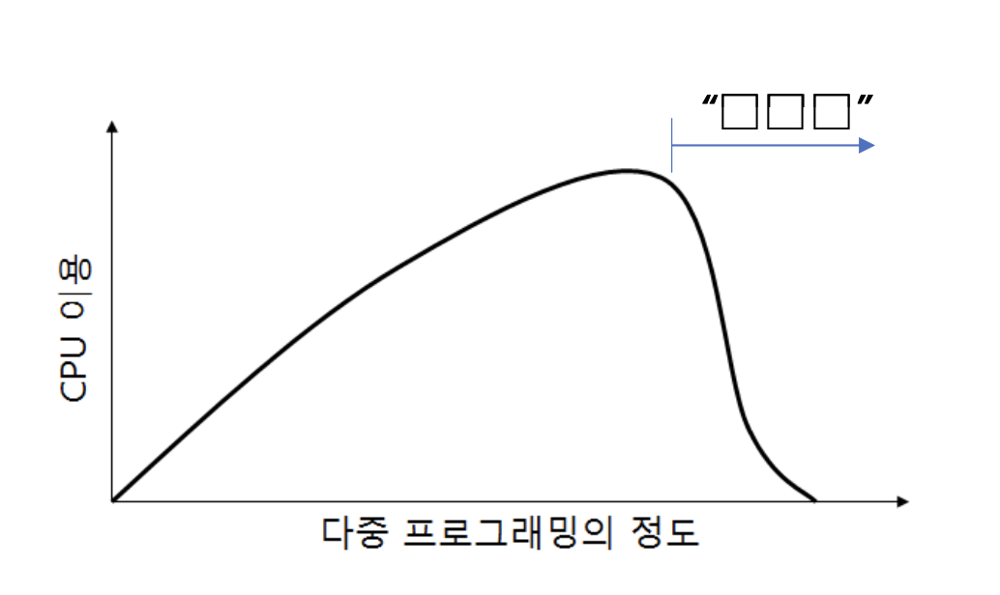

# 플래시 메모리와 관련하여 다음 물음에 답하시오.

## 1. 플래시 메모리에서 TLC(Triple Level Cell)는 SLC(Single Level Cell)와 MLC(Multiple Level Cell) 에 비해 단위 면적당 저장 용량이 증가하지만 읽기 및 쓰기 속도가 떨어진다. 그 이유를 설명하시오.

플래시 메모리에서 **TLC(Triple Level Cell)**가 **SLC(Single Level Cell)**와 **MLC(Multiple Level Cell)**에 비해 단위 면적당 저장 용량이 증가하지만 읽기 및 쓰기 속도가 떨어지는 이유는, 각 셀에 저장되는 데이터의 비트 수가 증가하기 때문입니다.

먼저, SLC는 각 셀에 1비트의 데이터를 저장하며, 셀당 두 가지 상태(0 또는 1)만 구분하면 되기 때문에 전압을 감지하고 데이터를 읽고 쓰는 과정이 단순합니다. 이로 인해 SLC는 읽기와 쓰기 속도가 빠르고, 데이터의 신뢰성도 높습니다.

반면에, MLC는 각 셀에 2비트의 데이터를 저장하여 셀당 네 가지 상태(00, 01, 10, 11)를 구분해야 합니다. 이로 인해 전압을 더 세밀하게 조절해야 하며, 이는 SLC에 비해 읽기와 쓰기 속도가 다소 느려지는 결과를 초래합니다.

TLC의 경우, 각 셀에 3비트의 데이터를 저장하게 되며, 이를 위해 여덟 가지 상태(000, 001, 010, 011, 100, 101, 110, 111)를 구분해야 합니다. 이러한 다수의 상태를 구분하기 위해서는 전압 레벨을 매우 세밀하게 조절해야 하며, 이 과정에서 데이터를 정확하게 읽고 쓰는 시간이 더 길어지게 됩니다. 전압 레벨 간의 차이가 작아질수록, 정확한 전압을 설정하거나 이를 감지하는 데 필요한 시간이 증가하며, 이는 읽기와 쓰기 속도를 저하시키는 주요 원인이 됩니다.

또한, 비트 수가 증가함에 따라 에러 발생 가능성도 높아집니다. TLC에서는 전압 레벨이 세밀해지고 상태가 많아짐에 따라 에러를 검출하고 수정하는 과정이 더 복잡해지며, 이러한 오류 정정 과정도 속도 저하를 유발합니다. 더불어, 셀에 저장되는 데이터가 많아질수록 셀의 내구성이 감소하게 되며, 이는 플래시 메모리의 전반적인 성능과 안정성에도 영향을 미칩니다.

결론적으로, TLC는 단위 면적당 더 많은 데이터를 저장할 수 있지만, 전압 제어의 복잡성과 에러율 증가로 인해 읽기 및 쓰기 속도가 SLC나 MLC에 비해 떨어지게 됩니다.

## 2. 플래시 메모리를 사용하는 SSD(Solid State Drive)는 블록과 페이지를 기반으로 하기 때문에 섹터를 기반으로 하는 운영체제에서 직접 사용이 불가능하다. 이 때문에 SSD 컨트롤러에서 플래시 변환 계층(Flash Translation Layer, FTL)을 사용하여 물리 블록과 페이지 위에 논리 섹터를 구현하고 있다. FTL에는 플래시 메모리의 특성 때문에 필요한 추가 기능인 웨어 레벨링(Wear Leveling), 가비지 콜렉션(Garbage Collection)이 포함되어 있다. 위 두가지 기능에 대해 설명하시오.

**웨어 레벨링(Wear Leveling)**

플래시 메모리는 각 셀에 대해 쓰기와 지우기 작업이 반복될 수 있는 횟수가 제한되어 있습니다. 특정 셀에 쓰기 작업이 집중될 경우, 그 셀은 다른 셀보다 빠르게 마모되어 사용할 수 없게 되는 문제가 발생할 수 있습니다. 웨어 레벨링은 이러한 문제를 해결하기 위해 고안된 기술입니다.

웨어 레벨링은 SSD 내 모든 셀의 쓰기 횟수를 고르게 분산시키는 기능입니다. 이를 통해 특정 셀이 조기에 마모되는 것을 방지하고, SSD 전체의 수명을 연장할 수 있습니다. 웨어 레벨링은 주로 두 가지 방식으로 구현됩니다. **동적 웨어 레벨링(Dynamic Wear Leveling)**은 자주 변경되는 데이터가 저장된 블록 간의 쓰기 횟수를 균등하게 분산시키며, **정적 웨어 레벨링(Static Wear Leveling)**은 자주 변경되지 않는 데이터도 주기적으로 다른 블록으로 이동시켜 모든 셀이 균일하게 사용되도록 합니다. 이 두 가지 방법을 통해 SSD는 전반적인 내구성을 유지할 수 있습니다.

**가비지 콜렉션(Garbage Collection)**

플래시 메모리에서는 데이터를 덮어쓰는 것이 불가능하며, 데이터를 삭제하기 위해서는 전체 블록을 지워야 하는 특성이 있습니다. 그러나, 일부 데이터가 삭제되더라도 해당 블록 내의 다른 데이터가 유효한 상태라면, 블록 전체를 지우는 것이 어려워집니다. 이로 인해 남아 있는 유효하지 않은 데이터는 가비지(쓰레기)로 남게 되며, 새로운 데이터를 기록할 수 있는 공간이 줄어들게 됩니다. 가비지 콜렉션은 이러한 가비지를 정리하여 새로운 데이터를 기록할 수 있는 공간을 확보하는 기능입니다.

가비지 콜렉션 과정은 먼저 유효한 데이터를 빈 블록으로 옮기고, 가비지가 포함된 블록을 지우는 방식으로 진행됩니다. 이를 통해 SSD는 새로운 데이터를 기록할 수 있는 깨끗한 블록을 확보하게 되며, 성능 저하를 방지할 수 있습니다. 특히, SSD가 가득 차서 사용할 수 있는 공간이 부족해질 때 가비지 콜렉션은 성능 유지에 중요한 역할을 합니다.

# 아래는 어느 회사의 급여시스템 데이터베이스이다. 다음 물음에 답하시오.

> 직원(<u>직원번호</u>, 이름, 직책, 부서번호*, 입사일자) 부서(부서번호, 부서명)
> 급여(<u>직원번호*</u>, 금액, <u>지급일자</u>)
>
> (주) 밑줄 친 부분은 기본키(Primary Key)를, \*로 표시한 부분은 외래키(Foreign Key)를 각각 의미하며, 지급일자는 ‘YYYYMMDD’ 형식

## 1. 2023년 8월 21일 직원에게 정기급여가 지급되었다. 이날 지급된 정기급여 금액이 3,000,000원 이상 인 직원의 직원번호와 지급한 금액을 조회하는 SQL문을 작성하시오. (단, 조회 결과는 직원번호 오름차순으로 표시)

```sql
SELECT 직원번호, 금액
FROM 급여
WHERE 지급일자 = '20230821'
  AND 금액 >= 3000000
ORDER BY 직원번호 ASC;
```

## 2. 직원들이 소속된 부서가 바뀌지 않았을 때, 소속 부서명이 ‘조사국’인 직원들에게 2022년 한해 지급된 총 급여액을 조회하는 SQL문을 작성하시오.

```sql
SELECT E.직원번호, SUM(G.금액) AS 총급여액
FROM 직원 E
JOIN 부서 D ON E.부서번호 = D.부서번호
JOIN 급여 G ON E.직원번호 = G.직원번호
WHERE D.부서명 = '조사국'
  AND G.지급일자 BETWEEN '20220101' AND '20221231'
GROUP BY E.직원번호;
```

## 3. ‘부서’ 테이블에 문자형(CHAR) 8Byte인 ‘부서위치’ 열(Column)을 추가하는 SQL문을 작성하시오.

```sql
ALTER TABLE 부서
ADD 부서위치 CHAR(8);
```

# 데이터베이스에서의 트랜잭션과 관련하여 다음 물음에 답하시오.

## 1. 트랜잭션의 ACID 성질을 열거하고 설명하시오.

**Atomicity (원자성)**

원자성은 트랜잭션이 수행될 때, 그 트랜잭션 내의 모든 작업이 모두 성공하거나, 반대로 아무 작업도 수행되지 않은 상태로 남아야 한다는 것을 의미합니다. 트랜잭션은 하나의 작업 단위로 처리되며, 트랜잭션 도중 오류가 발생하면, 그 트랜잭션 내의 모든 작업은 모두 취소되어 데이터베이스는 트랜잭션 이전의 상태로 되돌아갑니다. 예를 들어, 은행에서 A 계좌에서 B 계좌로 자금을 이체하는 트랜잭션이 있을 때, 이체가 완전히 이루어지지 않는다면, A 계좌에서 출금된 금액도 원래대로 복구되어야 합니다.

**Consistency (일관성)**

일관성은 트랜잭션이 완료된 후 데이터베이스가 일관된 상태를 유지해야 한다는 것을 의미합니다. 이는 트랜잭션이 데이터베이스의 무결성 제약 조건을 위반하지 않고 정상적으로 수행되었음을 보장합니다. 트랜잭션이 시작되기 전의 데이터베이스 상태가 일관성이 있었다면, 트랜잭션이 완료된 후에도 데이터베이스는 여전히 일관된 상태를 유지해야 합니다. 예를 들어, 은행의 모든 계좌 총합이 트랜잭션 전후에 동일하게 유지되는 것이 일관성의 예입니다.

**Isolation (고립성)**

고립성은 여러 트랜잭션이 동시에 수행될 때, 각 트랜잭션이 다른 트랜잭션의 중간 결과에 영향을 받지 않아야 한다는 것을 의미합니다. 각 트랜잭션은 독립적으로 수행되어야 하며, 다른 트랜잭션이 완료되기 전까지는 그 결과를 볼 수 없습니다. 이로 인해 트랜잭션 간 간섭이 방지되고, 데이터의 일관성이 유지됩니다. 예를 들어, 두 명의 사용자가 동시에 같은 계좌에서 자금을 인출하려고 할 때, 한 트랜잭션이 완료되기 전까지 다른 트랜잭션은 그 결과를 알 수 없습니다.

**Durability (지속성)**

지속성은 트랜잭션이 성공적으로 완료된 후 그 결과가 영구적으로 데이터베이스에 저장되어야 한다는 것을 의미합니다. 이는 시스템에 장애가 발생하더라도 커밋된 트랜잭션의 결과가 손실되지 않고 보존됨을 보장합니다. 이를 위해 데이터베이스 시스템은 로그나 백업과 같은 방법을 사용하여 트랜잭션의 결과를 안전하게 저장합니다. 예를 들어, 은행 계좌에서 이체가 완료된 후 전산 시스템에 문제가 발생하더라도, 이체된 금액은 원래대로 유지됩니다.

## 2. 다중 사용자 환경을 지원하는 데이터베이스는 여러 트랜잭션들이 성공적으로 동시에 실행될 수 있도록 동시성 제어(Concurrency Control)를 하고 있다. 동시성 제어방법 중 2단계 락킹규약(2 Phase Locking Protocol, 2PLP)의 두 가지 단계와 2PLP를 준수할 때 얻을 수 있는 장점을 설명하시오.

**2단계 락킹 규약(2PLP)의 두 가지 단계**

1. **확장 단계(Growing Phase)**

   - **설명**: 확장 단계에서는 트랜잭션이 필요한 자원에 대해 락을 획득하는 단계입니다. 트랜잭션이 데이터에 접근하려면 먼저 해당 데이터에 대한 락을 확보해야 하며, 이 과정에서 필요한 모든 락을 얻을 수 있습니다. 그러나 이 단계에서는 한 번 획득한 락을 해제할 수는 없습니다. 즉, 트랜잭션이 필요한 모든 자원을 확보할 때까지 락을 추가적으로 얻을 수만 있고, 해제는 할 수 없는 단계입니다.
   - **특징**: 이 단계는 트랜잭션이 필요한 모든 자원을 확보할 때까지 지속되며, 트랜잭션이 락을 해제하기 시작하면 이 단계는 종료됩니다.

2. **축소 단계(Shrinking Phase)**
   - **설명**: 축소 단계에서는 트랜잭션이 더 이상 추가적인 락을 획득하지 않고, 이미 획득한 락을 해제하는 단계입니다. 이 단계에서는 새로운 락을 얻는 것이 불가능하며, 오직 기존에 획득한 락을 해제하는 것만 가능합니다. 트랜잭션이 더 이상 자원을 필요로 하지 않으면, 트랜잭션의 종료와 함께 모든 락을 해제하게 됩니다.
   - **특징**: 이 단계는 트랜잭션이 모든 작업을 마치고 자원을 해제하기 시작할 때 시작되며, 트랜잭션이 종료될 때까지 계속됩니다.

**2PLP를 준수할 때 얻을 수 있는 장점**

1. **직렬 가능성 보장**

   - **설명**: 2PLP를 준수하면 트랜잭션들이 서로 충돌하지 않고 안전하게 실행되도록 보장할 수 있습니다. 직렬 가능성(Serializability)은 여러 트랜잭션이 동시에 실행될 때도, 마치 순차적으로 실행된 것과 동일한 결과를 얻을 수 있도록 보장하는 속성입니다. 이로써 데이터의 일관성을 유지할 수 있습니다. 즉, 트랜잭션들이 서로 간섭하지 않고 독립적으로 수행될 수 있도록 보장하는 것입니다.

2. **데이터 무결성 유지**

   - **설명**: 2PLP는 트랜잭션이 수행되는 동안 데이터의 무결성을 유지하는 데 효과적입니다. 여러 트랜잭션이 동일한 데이터에 접근할 때, 락을 통해 트랜잭션 간의 간섭을 방지하고, 데이터의 일관성을 보장합니다. 이를 통해 데이터베이스의 신뢰성을 높일 수 있습니다.

3. **교착 상태(Deadlock) 관리 가능**
   - **설명**: 2PLP는 교착 상태가 발생할 가능성을 줄이기 위한 기반을 제공합니다. 비록 2PLP 자체가 교착 상태를 완전히 방지하지는 않지만, 교착 상태가 발생할 수 있는 지점을 명확히 함으로써, 시스템이 교착 상태를 탐지하거나 이를 해결할 수 있는 전략을 적용할 수 있습니다. 예를 들어, 타임아웃이나 데드락 탐지 알고리즘과 함께 사용하여 교착 상태를 관리할 수 있습니다.

## 3. 일련의 트랜잭션 집합 내 다른 트랜잭션이 lock을 유지하고 있고 어떠한 트랜잭션도 unlock연산을 할 수 없는 상태를 교착(Deadlock)상태라고 부른다. 교착상태가 일어나지 않도록 사전에 예방하는 방법을 설명하시오.

첫째, **자원 할당 순서(Resource Allocation Ordering)** 방법이 있습니다. 이 방법은 모든 자원에 고유한 순서를 부여하고, 트랜잭션이 자원을 요청할 때 이 순서에 따라 자원을 획득하도록 하는 것입니다. 트랜잭션은 자신이 현재 보유한 자원보다 순서가 낮은 자원만 추가로 요청할 수 있으며, 순서가 높은 자원은 먼저 해제한 후에만 요청할 수 있습니다. 이를 통해 순환적인 대기 상황을 방지하고 교착 상태의 발생을 예방할 수 있습니다.

둘째, **자원 사전 할당(Preemption of Resources)** 방법이 있습니다. 이 방법은 트랜잭션이 필요한 자원을 즉시 획득할 수 없는 경우, 이미 점유한 자원을 반납하도록 하여 교착 상태를 방지하는 방법입니다. 트랜잭션이 자원을 모두 확보하기 전에는 실행되지 않도록 하여, 자원을 점유한 상태에서 다른 자원을 기다리는 상황을 원천적으로 차단할 수 있습니다.

셋째, **점유와 대기 방지(No Hold and Wait)** 방법이 있습니다. 이 방법은 트랜잭션이 자원을 점유한 상태에서 추가적인 자원을 요청하지 못하도록 하여 교착 상태를 방지하는 방법입니다. 트랜잭션이 시작되기 전에 필요한 모든 자원을 한꺼번에 할당받고, 필요한 자원을 모두 확보하지 못하면 트랜잭션이 시작되지 않도록 합니다. 이 방법을 통해 자원을 점유한 상태에서 다른 자원을 기다리는 상황을 예방할 수 있습니다.

넷째, **타임아웃(Timeout)** 방법이 있습니다. 이 방법은 트랜잭션이 일정 시간 동안 필요한 자원을 획득하지 못할 경우, 해당 트랜잭션을 자동으로 중단하거나 롤백시키는 방식으로 교착 상태를 방지하는 방법입니다. 타임아웃을 설정함으로써 교착 상태가 장시간 지속되지 않도록 하고, 발생한 교착 상태를 자동으로 해소할 수 있도록 합니다.

# 소프트웨어 공학과 관련하여 다음 물음에 답하시오.

## 1. 블랙박스 테스트 기법을 세 가지 이상 작성하시오.

첫째, **동등 분할 테스트(Equivalence Partitioning)** 기법이 있습니다. 이 기법은 입력 데이터를 여러 개의 동등한 클래스 또는 그룹으로 나누고, 각 그룹에서 대표적인 값을 선택하여 테스트를 수행합니다. 같은 그룹 내의 데이터는 동일한 방식으로 처리될 것으로 가정되기 때문에, 그룹 내에서 하나의 값을 테스트해도 해당 그룹의 다른 값들도 동일하게 처리된다고 가정할 수 있습니다. 이를 통해 테스트 케이스의 수를 줄이고, 효율적인 테스트를 수행할 수 있습니다.

둘째, **경계 값 분석(Boundary Value Analysis)** 기법이 있습니다. 이 기법은 입력 값의 경계에 해당하는 값에서 오류가 발생할 가능성이 높다는 점에 착안하여, 경계 근처의 값을 집중적으로 테스트하는 방법입니다. 일반적으로 최소값, 최대값, 그 주변 값을 선택하여 테스트를 수행하며, 이러한 경계 값에서 발생할 수 있는 잠재적인 오류를 발견하는 데 효과적입니다.

셋째, **결정 테이블 테스트(Decision Table Testing)** 기법이 있습니다. 이 기법은 여러 조건과 그에 따른 결과를 표 형태로 정리한 뒤, 가능한 모든 조합에 대해 테스트하는 방법입니다. 특히, 복잡한 비즈니스 로직이나 여러 조건이 결합된 상황을 테스트할 때 유용합니다. 결정 테이블은 조건과 결과 간의 관계를 명확히 보여주기 때문에, 다양한 입력 조건과 그에 따른 출력을 체계적으로 테스트할 수 있습니다.

## 2. 테스트 오라클(Test Oracle)이 무엇인지 설명하시오.

테스트 오라클(Test Oracle)은 소프트웨어 테스트에서 테스트 결과가 올바른지 여부를 판단하기 위한 기준이나 메커니즘을 의미합니다. 즉, 테스트 오라클은 주어진 입력에 대해 소프트웨어가 생성한 실제 출력이 예상된 출력과 일치하는지를 검증하는 역할을 합니다.

테스트 오라클은 다양한 형태로 존재할 수 있으며, 소프트웨어 시스템이 특정 입력에 대해 올바른 결과를 반환하는지 판단하는 데 사용됩니다. 이는 단순한 함수의 결과 비교부터, 복잡한 시스템 전체의 동작이 요구 사항과 일치하는지 확인하는 것까지 다양한 범위에서 적용됩니다.

테스트 오라클은 소프트웨어의 기능적 요구사항이나 명세에 기반하여, 무엇이 올바른 출력인지 미리 정의해 놓은 규칙이나 모델을 사용하여 테스트 결과를 평가합니다. 이를 통해 개발자는 소프트웨어가 예상대로 동작하는지 확인하고, 오류나 결함을 발견할 수 있습니다.

# 컴퓨터구조와 관련하여 다음 물음에 답하시오.

## 1. 다음은 동일한 소스 코드를 작성한 뒤 명령어 집합(Instruction Set)이 다른 컴퓨터에서 어셈블리어 로 컴파일한 결과이다. A와 B에 대하여 RISC/CISC 중 어떤 것인지 각각 쓰고, 장단점을 설명하시오.

```assembly
; A(X86-64)
main:
push rbp
mov rbp, rsp
mov DWORD PTR [rbp-4], 1 mov DWORD PTR [rbp-8], 2 mov edx, DWORD PTR [rbp-4] mov eax, DWORD PTR [rbp-8] add eax, edx
mov DWORD PTR [rbp-12], eax mov eax, 0
pop rbp
ret
```

```assembly
; B(ARM)

main:
push {r7}
sub sp, sp, #20 add r7, sp, #0 movs r3, #1
str r3, [r7, #12] movs r3, #2
str r2, [r7, #8] ldr r2, [r7, #12] ldr r3, [r7, #8] add r3, r3, r2 str r3, [r7, #4] movs r3, #0
mov r0, r3
adds r7, r7, #20 mov sp, r7
ldr r7, [sp], #4 bx lr
```

주어진 어셈블리 코드를 분석해보면, A는 **CISC (Complex Instruction Set Computing)** 아키텍처에 해당하고, B는 **RISC (Reduced Instruction Set Computing)** 아키텍처에 해당합니다. 각각의 아키텍처에 대해 설명하고, 그 장단점을 설명하겠습니다.

### A(X86-64) - CISC (Complex Instruction Set Computing)

**설명**:  
A의 코드(X86-64)는 CISC 아키텍처의 특징을 보여줍니다. CISC 아키텍처는 복잡한 명령어 집합을 사용하여, 하나의 명령어가 여러 작업을 수행할 수 있도록 설계되었습니다. 예를 들어, 메모리에서 데이터를 직접 가져와 연산을 수행하거나, 복잡한 계산을 단일 명령어로 처리할 수 있습니다.

**장점**:

- **코드 효율성**: CISC는 복잡한 작업을 단일 명령어로 처리할 수 있기 때문에, 어셈블리 코드가 상대적으로 간결할 수 있습니다. 이로 인해 메모리 사용량이 줄어들 수 있습니다.
- **호환성**: 오랜 역사를 가진 CISC 아키텍처는 다양한 소프트웨어와 높은 호환성을 유지하고 있습니다.

**단점**:

- **복잡한 하드웨어 설계**: 명령어 집합이 복잡하고 다양한 기능을 포함하고 있기 때문에, 이를 처리하는 하드웨어가 복잡해지고, 제조 비용이 증가할 수 있습니다.
- **성능 저하**: 명령어의 복잡성으로 인해, 디코딩과 실행 과정에서 시간이 더 걸릴 수 있으며, 특히 파이프라이닝과 같은 고속 처리 기술에서 비효율적일 수 있습니다.

### B(ARM) - RISC (Reduced Instruction Set Computing)

**설명**:  
B의 코드(ARM)는 RISC 아키텍처의 특징을 보여줍니다. RISC 아키텍처는 단순하고 효율적인 명령어 집합을 사용하여, 각 명령어가 한 가지 작업을 수행하도록 설계되었습니다. 모든 명령어는 고정된 길이를 가지며, 대부분의 연산은 레지스터 간에 수행됩니다.

**장점**:

- **고속 처리**: RISC 아키텍처는 명령어가 단순하고 고정된 길이이기 때문에, 파이프라이닝과 같은 기술을 사용하여 명령어를 빠르게 처리할 수 있습니다.
- **효율적인 하드웨어 설계**: 명령어 집합이 단순하기 때문에, 하드웨어 설계가 비교적 간단하고, 전력 소모가 적습니다. 이는 특히 모바일 기기와 같은 환경에서 매우 유리합니다.

**단점**:

- **더 많은 명령어 필요**: 복잡한 작업을 수행하려면 여러 개의 단순한 명령어를 조합해야 하기 때문에, 코드가 길어지고, 메모리 사용량이 증가할 수 있습니다.
- **소프트웨어 복잡성 증가**: 하드웨어가 단순한 만큼, 소프트웨어(특히 컴파일러)가 복잡한 작업을 효과적으로 처리하기 위해 더 많은 최적화 작업을 수행해야 할 수 있습니다.

### 요약

- **A(X86-64)**는 **CISC** 아키텍처로, 복잡한 명령어 집합을 사용하여 코드 효율성이 높지만, 하드웨어 설계가 복잡하고 성능이 저하될 수 있습니다.
- **B(ARM)**는 **RISC** 아키텍처로, 단순하고 효율적인 명령어 집합을 사용하여 고속 처리와 효율적인 하드웨어 설계를 가능하게 하지만, 더 많은 명령어가 필요하고 소프트웨어 최적화가 중요합니다.

# 네트워크와 관련하여 다음 물음에 답하시오.

## 1. 아래 그림을 보고 ARP와 RARP 프로토콜의 정의와 필요성을 각각 설명하시오.

**ARP (Address Resolution Protocol)**와 **RARP (Reverse Address Resolution Protocol)**는 네트워크에서 IP 주소와 MAC 주소 간의 매핑을 관리하는 프로토콜입니다.

### 1. ARP (Address Resolution Protocol)

**정의**:  
ARP는 네트워크에서 호스트가 다른 호스트의 IP 주소를 알고 있을 때, 해당 IP 주소에 대응하는 MAC 주소(물리 주소)를 찾기 위해 사용하는 프로토콜입니다. IP 주소는 네트워크 계층에서 사용되는 논리적 주소로, 물리적인 네트워크 장비 간의 데이터 전송을 위해서는 MAC 주소가 필요합니다. ARP는 이 IP 주소를 MAC 주소로 변환하여, 데이터가 올바른 장치에 도달할 수 있도록 합니다.

**필요성**:  
ARP는 로컬 네트워크에서 장치들이 데이터를 주고받을 때 매우 중요합니다. IP 주소만으로는 패킷이 목적지에 도달할 수 없기 때문에, IP 주소를 해당 장치의 MAC 주소로 변환하는 과정이 필요합니다. 예를 들어, 컴퓨터가 다른 컴퓨터로 데이터를 전송할 때, ARP를 사용하여 상대방의 MAC 주소를 알아낸 후, 해당 주소로 데이터를 전송할 수 있습니다. ARP 없이는 로컬 네트워크 내에서의 통신이 불가능해집니다.

### 2. RARP (Reverse Address Resolution Protocol)

**정의**:  
RARP는 ARP와 반대로, 장치가 자신의 MAC 주소를 알고 있지만, 네트워크 상에서 자신에게 할당된 IP 주소를 알지 못할 때 사용하는 프로토콜입니다. RARP는 장치가 네트워크에 연결되었을 때, 자신의 MAC 주소를 기반으로 IP 주소를 할당받기 위해 사용됩니다.

**필요성**:  
RARP는 주로 디스크가 없는 워크스테이션이나 초기화 시 IP 주소가 설정되지 않은 장치에서 사용됩니다. 이 장치들은 자신의 MAC 주소만 알고 있으며, 네트워크 상에서 사용할 IP 주소를 알아야만 통신할 수 있습니다. RARP는 이러한 장치가 네트워크 관리자 또는 DHCP 서버와 같은 서비스로부터 IP 주소를 할당받을 수 있도록 도와줍니다. RARP가 없다면, 초기화 과정에서 IP 주소가 없는 장치는 네트워크에 연결될 수 없고, 다른 장치와의 통신이 불가능해집니다.

### 요약

- **ARP**는 IP 주소를 알고 있을 때 해당 IP 주소에 대응하는 MAC 주소를 찾기 위한 프로토콜로, 로컬 네트워크에서 장치 간의 통신을 가능하게 합니다.
- **RARP**는 장치가 자신의 MAC 주소를 기반으로 IP 주소를 할당받기 위한 프로토콜로, 초기화 시 IP 주소가 설정되지 않은 장치가 네트워크에 연결될 수 있도록 돕습니다.

## 2. ARP 프로토콜에서 발생할 수 있는 ARP 스푸핑(Spoofing)의 공격 방식을 설명하시오.

**ARP 스푸핑(ARP Spoofing)**은 ARP 프로토콜의 취약점을 악용하여 네트워크 상에서 공격자가 자신의 MAC 주소를 다른 장치의 MAC 주소로 속이는 공격 방식입니다. 이 공격은 주로 로컬 네트워크에서 발생하며, 공격자는 이를 통해 네트워크 트래픽을 가로채거나, 중간자 공격(Man-in-the-Middle Attack)을 수행할 수 있습니다.

### ARP 스푸핑의 공격 방식

1. **위조된 ARP 응답 전송**:

   - ARP 스푸핑 공격에서, 공격자는 자신을 타겟 장치나 라우터의 MAC 주소로 위장하기 위해 위조된 ARP 응답을 네트워크에 전송합니다. ARP는 신뢰 기반의 프로토콜이기 때문에, 장치는 새로운 ARP 응답을 수신하면 기존의 ARP 캐시(ARP Table)에 있는 정보를 덮어쓰고 갱신합니다.

2. **ARP 캐시 변조**:

   - 공격자가 위조된 ARP 응답을 전송하면, 해당 응답을 수신한 장치는 자신의 ARP 캐시를 갱신합니다. 이로 인해, 네트워크 내의 다른 장치들은 특정 IP 주소가 공격자의 MAC 주소와 연관된 것으로 잘못 인식하게 됩니다. 예를 들어, 공격자가 라우터의 IP 주소에 자신의 MAC 주소를 매핑하는 ARP 응답을 보낸다면, 네트워크의 다른 장치들은 해당 IP 주소로 데이터를 전송할 때, 공격자에게 데이터를 보내게 됩니다.

3. **트래픽 가로채기 또는 중간자 공격**:

   - ARP 스푸핑을 통해 공격자는 네트워크 상의 트래픽을 자신이 통제할 수 있는 위치로 가로챌 수 있습니다. 가로챈 트래픽을 읽거나 수정한 후 원래 목적지로 전달하는 중간자 공격이 가능해집니다. 이를 통해 공격자는 로그인 정보, 암호, 금융 거래 데이터 등 민감한 정보를 탈취할 수 있습니다.

4. **네트워크 마비 및 서비스 거부 공격**:
   - 공격자가 네트워크 내 여러 장치에 대해 ARP 스푸핑을 수행하면, 트래픽이 올바른 경로로 전달되지 않아 네트워크 마비를 일으킬 수 있습니다. 또한, 특정 장치의 트래픽을 모두 자신에게 유도한 후 해당 트래픽을 무시하거나 삭제함으로써, 서비스 거부 공격(DoS)을 수행할 수 있습니다.

### 요약

ARP 스푸핑은 ARP 프로토콜의 신뢰 기반 특성을 악용하여, 공격자가 자신의 MAC 주소를 다른 장치의 MAC 주소로 위장하는 공격입니다. 이를 통해 공격자는 네트워크 트래픽을 가로채거나, 중간자 공격을 수행하고, 심지어 네트워크 마비나 서비스 거부 공격까지 일으킬 수 있습니다. ARP 스푸핑은 로컬 네트워크에서 발생할 수 있는 심각한 보안 위협 중 하나로, 이를 방지하기 위한 적절한 보안 대책이 필요합니다.

# TCP 연결과 관련하여 다음 물음에 답하시오.

## 1. 다음은 호스트 A가 호스트 B로 보내는 TCP 3-way Handshake의 연결 과정이다. ‘C’는 1Byte라고 할 때, 다음 그림의 빈칸을 작성하시오.

```plaintext
A: SYN=23, data='C'
B: ?, ?, data='C'
A: ACK=24
```

TCP 3-way Handshake에서 주어진 상황을 분석하면, 호스트 A가 호스트 B에게 SYN 패킷을 보내면서 초기 시퀀스 번호(SYN=23)와 1Byte의 데이터를 포함해 전송하고 있습니다. 이때 호스트 B는 A의 연결 요청을 승인하면서 자신의 초기 시퀀스 번호를 포함해 응답해야 합니다.

```plaintext
B: SYN=23, ACK=24, data='C'
```

## 2. TCP 통신 중 발생할 수 있는 SYN Flooding의 공격 방식과 해결 방법을 설명하시오.

**SYN Flooding**은 TCP 3-way Handshake 과정을 악용하여 서버의 자원을 고갈시키는 대표적인 **DoS(Denial of Service)** 공격입니다. 이 공격은 TCP 연결을 설정하는 초기 단계에서 발생하며, 서버가 정상적인 클라이언트 요청을 처리하지 못하게 만들고, 결국 서비스 거부 상태로 이어지게 합니다.

### SYN Flooding의 공격 방식

SYN Flooding 공격은 다음과 같은 방식으로 진행됩니다:

첫째, 공격자는 다수의 **SYN 패킷**을 서버에 전송합니다. 이 SYN 패킷들은 TCP 연결 요청을 의미하며, 정상적인 요청과 동일한 형태를 가지고 있습니다. 그러나 공격자는 이러한 패킷을 비정상적으로 높은 빈도로 전송하며, 이때 주로 가짜 IP 주소를 사용하거나 실제로 응답할 수 없는 IP 주소를 위조하여 사용합니다.

둘째, 서버는 각 SYN 패킷에 대해 응답하기 위해 **SYN-ACK** 패킷을 전송하고, 동시에 해당 연결을 처리하기 위해 내부 자원을 할당합니다. 서버는 정상적인 TCP 연결이 이루어지기를 기대하며, 클라이언트가 ACK 패킷을 보내올 때까지 대기 상태를 유지합니다. 그러나 공격자는 ACK 패킷을 보내지 않거나, 가짜 IP 주소를 사용했기 때문에 서버는 ACK 패킷을 수신하지 못합니다.

셋째, ACK 패킷을 받지 못한 서버는 연결 대기 상태를 일정 시간 동안 유지하게 되며, 이 과정에서 계속해서 새로운 SYN 패킷들이 들어오면 서버는 점점 더 많은 자원을 소비하게 됩니다. 결국, 서버의 자원(메모리, CPU 등)이 고갈되어 더 이상 새로운 연결 요청을 처리할 수 없는 상태가 됩니다. 이는 정상적인 사용자가 서버에 접근하지 못하는 서비스 거부 상태로 이어지게 됩니다.

### SYN Flooding 해결 방법

SYN Flooding 공격을 방어하기 위해서는 여러 가지 대책이 필요합니다:

첫째, **SYN 쿠키(SYN Cookie)** 기법을 사용할 수 있습니다. SYN 쿠키는 서버가 SYN-ACK 패킷을 전송할 때, 클라이언트가 보낸 SYN 패킷의 정보를 해시 값으로 인코딩하여 응답에 포함시키는 방식입니다. 이 방법을 통해 서버는 초기 SYN 요청에 대해 자원을 할당하지 않으며, 클라이언트가 실제로 ACK 패킷을 보내올 때에만 자원을 할당하게 됩니다. 이를 통해 가짜 SYN 요청으로 인한 자원 낭비를 방지할 수 있습니다.

둘째, **SYN-ACK 재전송 제한**을 설정할 수 있습니다. 서버는 SYN-ACK 패킷을 전송한 후 클라이언트의 응답을 기다리며, 이 기간 동안 재전송 횟수를 제한함으로써 공격에 의한 자원 소모를 줄일 수 있습니다. 이는 서버가 불필요한 자원을 반복적으로 소비하는 것을 방지하는 데 도움이 됩니다.

셋째, **방화벽 및 IP 필터링**을 통해 의심스러운 트래픽을 차단할 수 있습니다. 방화벽은 비정상적인 패턴을 감지하여 공격자로부터 들어오는 다량의 SYN 요청을 필터링하고, 서버가 처리해야 하는 트래픽의 양을 줄이는 역할을 합니다. 또한, IP 주소별로 허용되는 동시 연결 수를 제한하여 SYN Flooding 공격을 완화할 수 있습니다.

넷째, **속도 제한(Rate Limiting)** 기법을 적용하여 특정 시간 동안 서버가 처리할 수 있는 SYN 패킷의 수를 제한할 수 있습니다. 이를 통해 서버가 갑작스럽게 대량의 SYN 요청에 노출되는 것을 방지하고, 공격의 효과를 최소화할 수 있습니다.

마지막으로, **자원 할당 최적화**를 통해 서버의 자원 소모를 줄일 수 있습니다. 서버는 초기 연결 요청에 대해 최소한의 자원만 할당하고, 실제로 연결이 성립되었을 때만 추가 자원을 할당하도록 설계할 수 있습니다. 이 방법은 자원의 효율적인 사용을 통해 공격으로 인한 피해를 줄이는 데 기여합니다.

## 3. TCP는 혼잡 윈도우(Congestion Window)를 사용하여 혼잡제어를 한다. 다음은 세그먼트 전송 수에 따른 TCP 혼잡 윈도우의 크기 변화를 나타낸 것이다. 다음 물음에 답하시오.

```plaintext
전송 수: 0, 혼잡 윈도우 크기: 1
전송 수: 1, 혼잡 윈도우 크기: 2
전송 수: 6, 혼잡 윈도우 크기: 10

전송 수: 10, 혼잡 윈도우 크기: 12
전송 수: 11, 혼잡 윈도우 크기: 6
```

### a. 0에서 6까지의 전송 수와 6에서 10까지의 구간을 지칭하는 혼잡제어 알고리즘이 무엇인지 쓰시오.

TCP 혼잡 제어에서 주어진 전송 수와 혼잡 윈도우 크기의 변화는 TCP의 혼잡 제어 알고리즘 중 **"Slow Start"**와 **"Congestion Avoidance"**를 나타냅니다. 각각의 구간에서 적용된 알고리즘은 다음과 같습니다:

#### 0에서 6까지의 전송 수 구간

이 구간에서는 혼잡 윈도우 크기가 지수적으로 증가하고 있습니다. 초기 혼잡 윈도우 크기가 1에서 시작하여 전송 수가 6일 때 10까지 증가하는 것을 볼 수 있습니다. 이러한 패턴은 **"Slow Start"** 알고리즘에 해당합니다. Slow Start는 TCP 연결이 처음 시작될 때 사용되며, 혼잡 윈도우 크기를 지수적으로 증가시키면서 네트워크의 용량을 탐색합니다.

#### 6에서 10까지의 전송 수 구간

이 구간에서는 혼잡 윈도우 크기가 비교적 완만하게 증가하고 있습니다. 전송 수가 6에서 10으로 증가하면서 혼잡 윈도우 크기가 10에서 12로 증가합니다. 이러한 패턴은 **"Congestion Avoidance"** 알고리즘에 해당합니다. Congestion Avoidance는 네트워크가 혼잡 상태에 가까워졌을 때 혼잡 윈도우 크기를 선형적으로 증가시키는 방식으로 혼잡을 피하려고 합니다.

따라서:

- **0에서 6까지의 구간**은 **"Slow Start"** 알고리즘이 적용되었습니다.
- **6에서 10까지의 구간**은 **"Congestion Avoidance"** 알고리즘이 적용되었습니다.

### b. 다른 알고리즘의 종류와 그 설명을 작성하시오.

TCP 혼잡 제어에는 여러 가지 알고리즘이 존재하며, 각각은 네트워크 혼잡을 관리하고 성능을 최적화하기 위해 다양한 접근 방식을 사용합니다. 주요 알고리즘들은 다음과 같습니다:

#### **Slow Start**

**설명**:  
TCP 연결이 처음 시작되거나, 패킷 손실이 발생한 후 혼잡 윈도우 크기(cwnd)를 빠르게 증가시키기 위한 알고리즘입니다. Slow Start는 혼잡 윈도우 크기를 1로 설정하고, ACK(응답) 패킷이 도착할 때마다 혼잡 윈도우 크기를 지수적으로 증가시킵니다. 즉, 혼잡 윈도우 크기는 한 번에 두 배로 늘어나며, 네트워크의 대역폭을 빠르게 탐색합니다. 이 과정은 혼잡 윈도우 크기가 임계값(통상 `ssthresh`라고 함)에 도달할 때까지 지속되며, 이후에는 Congestion Avoidance로 전환됩니다.

#### **Congestion Avoidance**

**설명**:  
혼잡 윈도우 크기가 Slow Start 임계값(ssthresh)에 도달하면, TCP는 혼잡을 피하기 위해 혼잡 윈도우 크기를 지수적으로 증가시키지 않고, 선형적으로 증가시키는 Congestion Avoidance 알고리즘으로 전환됩니다. 이때 혼잡 윈도우 크기는 매 RTT(Round-Trip Time)마다 한 세그먼트 크기만큼 증가합니다. 이는 네트워크가 안정된 상태로 진입하면서 혼잡이 발생하지 않도록 조절하는 방식입니다.

#### **Fast Retransmit**

**설명**:  
TCP는 데이터 패킷이 손실되었을 때, 재전송 타이머가 만료되기 전이라도 빠르게 손실을 감지하여 손실된 패킷을 재전송할 수 있도록 하는 알고리즘입니다. Fast Retransmit은 세 개의 중복된 ACK를 수신하면 해당 패킷이 손실된 것으로 간주하고, 즉시 손실된 패킷을 재전송합니다. 이를 통해 재전송 지연 시간을 줄여, 네트워크 성능을 향상시킵니다.

#### **Fast Recovery**

**설명**:  
Fast Recovery는 Fast Retransmit 이후에 혼잡 윈도우 크기를 조정하는 방법입니다. 손실이 발생한 후 혼잡 윈도우 크기를 `ssthresh`의 절반으로 줄이지만, Slow Start로 돌아가지 않고 Congestion Avoidance로 전환하여 혼잡 윈도우 크기를 선형적으로 증가시킵니다. 이는 네트워크 혼잡을 신속하게 완화하면서도 데이터 전송 속도를 급격히 떨어뜨리지 않기 위한 방법입니다.

#### **TCP Tahoe**

**설명**:  
TCP Tahoe는 초기 TCP 혼잡 제어 알고리즘으로, 패킷 손실이 감지되면 혼잡 윈도우 크기를 1로 줄이고 Slow Start 단계를 다시 시작합니다. 패킷 손실이 발생할 때마다 `ssthresh`를 현재 혼잡 윈도우 크기의 절반으로 설정하고, 그 후 혼잡 윈도우 크기를 1부터 다시 증가시키는 방식으로 동작합니다. 이 알고리즘은 신뢰성을 중시하지만, 성능 저하가 발생할 수 있습니다.

#### **TCP Reno**

**설명**:  
TCP Reno는 TCP Tahoe의 개선된 버전으로, Fast Retransmit과 Fast Recovery를 추가하여 패킷 손실 시 혼잡 윈도우 크기를 완전히 줄이지 않고, 보다 효율적으로 손실 복구를 수행합니다. 패킷 손실이 감지되면, 혼잡 윈도우 크기를 `ssthresh`로 줄이고, 이후 Fast Recovery 단계로 전환하여 혼잡 윈도우 크기를 선형적으로 증가시킵니다. 이는 성능을 개선하면서도 안정성을 유지하는 방식입니다.

#### **TCP Vegas**

**설명**:  
TCP Vegas는 패킷 손실 대신 네트워크 혼잡을 RTT를 기반으로 감지하여 혼잡 윈도우 크기를 조정하는 알고리즘입니다. TCP Vegas는 RTT의 변화를 모니터링하여 혼잡이 발생하기 전에 윈도우 크기를 조정합니다. 이를 통해 혼잡 발생을 미리 방지하고, 더 높은 네트워크 효율성을 달성할 수 있습니다.

### c. 11번째 세그먼트를 전송할 때 혼잡 윈도우의 크기가 1/2로 줄어든 이유를 설명하시오.

11번째 세그먼트를 전송할 때 혼잡 윈도우의 크기가 절반으로 줄어든 이유는 **패킷 손실**이 발생했기 때문입니다. TCP는 패킷 손실을 네트워크 혼잡의 신호로 간주하며, 이에 대응하여 혼잡 윈도우(Congestion Window, cwnd) 크기를 줄입니다.

구체적으로, TCP는 혼잡 윈도우 크기를 줄이는 두 가지 주요 메커니즘을 사용합니다:

**타임아웃 발생**: 만약 송신한 세그먼트에 대해 수신 확인(ACK)을 받지 못한 경우, 재전송 타이머가 만료되면 TCP는 패킷이 손실되었다고 판단합니다. 이 경우 혼잡 윈도우 크기를 1로 줄이고, `Slow Start` 알고리즘을 다시 시작합니다.

**중복 ACK 수신**: TCP Reno와 같은 알고리즘에서는 세 개의 중복된 ACK를 수신할 경우, 패킷 손실이 발생했다고 간주하고, 혼잡 윈도우 크기를 절반으로 줄입니다. 그런 다음 `Fast Retransmit`을 통해 손실된 패킷을 즉시 재전송하고, `Fast Recovery`를 통해 혼잡 윈도우를 선형적으로 증가시키며 네트워크 상태를 점진적으로 회복합니다.

따라서, 11번째 세그먼트를 전송할 때 혼잡 윈도우 크기가 절반으로 줄어든 것은 이전에 전송된 패킷 중 하나가 손실되었음을 나타내며, TCP는 이를 네트워크 혼잡의 징후로 해석하고, 혼잡 윈도우 크기를 줄여 네트워크에 대한 부하를 감소시키려는 조치를 취한 것입니다. 이는 네트워크의 안정성을 유지하고, 추가적인 패킷 손실을 방지하기 위한 TCP의 혼잡 제어 메커니즘입니다.

# 운영체제와 관련하여 다음 물음에 답하시오.

## 1. 프로세스(Process)와 쓰레드(Thread)의 정의 및 차이점을 설명하시오.

**프로세스(Process)**는 실행 중인 프로그램의 인스턴스로, 운영체제에서 독립적으로 실행되는 작업 단위를 의미합니다. 프로세스는 CPU, 메모리, 파일, 입출력 장치 등 여러 자원을 할당받아 수행되며, 고유한 주소 공간을 갖습니다. 각각의 프로세스는 서로 독립적으로 실행되며, 다른 프로세스와 자원을 공유하지 않는 것이 특징입니다. 프로세스 간의 통신은 보통 IPC(Inter-Process Communication) 기법을 통해 이루어집니다.

**쓰레드(Thread)**는 프로세스 내에서 실행되는 가장 작은 단위의 작업 흐름입니다. 하나의 프로세스는 여러 개의 쓰레드를 포함할 수 있으며, 이 쓰레드들은 동일한 프로세스 내에서 메모리와 자원을 공유합니다. 예를 들어, 전역 변수나 힙 영역을 공유하여 보다 효율적으로 작업을 수행할 수 있습니다. 쓰레드는 프로세스의 문맥(Context) 내에서 실행되므로, 프로세스보다 가볍고 빠르게 생성 및 관리할 수 있습니다.

### 프로세스와 쓰레드의 주요 차이점

1. **독립성 및 자원 관리**:

   - **프로세스**는 독립적인 실행 단위로, 운영체제로부터 별도의 주소 공간을 할당받아 실행됩니다. 각 프로세스는 자신의 메모리 공간과 자원을 독립적으로 관리하며, 다른 프로세스와 자원을 공유하지 않습니다. 이에 반해, **쓰레드**는 동일한 프로세스 내에서 자원과 메모리를 공유합니다. 쓰레드들은 같은 주소 공간을 사용하기 때문에, 데이터 공유가 쉽지만 동기화 문제가 발생할 수 있습니다.

2. **오버헤드**:

   - **프로세스**를 생성하거나 종료하는 데는 상대적으로 큰 오버헤드가 발생합니다. 프로세스 간 문맥 교환도 많은 자원을 소모합니다. 반면, **쓰레드**는 같은 프로세스 내에서 생성되므로 가볍고, 문맥 교환 시에도 적은 오버헤드로 빠르게 처리됩니다. 쓰레드 간의 데이터 공유도 프로세스 간 통신보다 효율적입니다.

3. **주소 공간**:

   - **프로세스**는 각각 독립된 주소 공간을 갖기 때문에, 다른 프로세스의 메모리에 직접 접근할 수 없습니다. 반면, **쓰레드**는 동일한 프로세스 내에서 주소 공간을 공유하여 서로의 메모리에 접근할 수 있습니다. 이로 인해 쓰레드 간의 통신이 빠르고 효율적이지만, 동기화 문제가 발생할 수 있어 적절한 관리가 필요합니다.

4. **통신 방식**:
   - **프로세스** 간의 통신은 파이프, 메시지 큐, 공유 메모리 등 IPC 기법을 사용하며, 이는 복잡하고 상대적으로 느릴 수 있습니다. **쓰레드**는 같은 프로세스 내에서 실행되므로, 메모리 공유를 통해 매우 빠르고 쉽게 통신할 수 있습니다. 이는 다중 쓰레드 환경에서 작업을 병렬로 처리할 때 큰 장점이 됩니다.

### 요약

프로세스는 운영체제에서 독립적으로 실행되는 작업 단위로, 고유한 주소 공간을 할당받아 자원을 관리하며, 다른 프로세스와는 자원을 공유하지 않습니다. 반면, 쓰레드는 프로세스 내에서 실행되는 작은 실행 단위로, 프로세스의 자원과 메모리를 공유하며 보다 가볍고 빠르게 처리됩니다. 프로세스는 독립성과 보안을 보장하지만, 오버헤드가 큰 반면, 쓰레드는 자원을 공유하여 효율적이지만, 동기화 문제를 적절히 관리해야 하는 과제가 있습니다.

## 2. 멀티코어 시스템에서 임계구역을 보호하기 위한 대표적인 기법에는 바쁜 대기(Busy Waiting)를 하 는 ‘스핀락(Spinlock)‘과 기다리는 동안 프로세스가 수면상태로 들어갈 수 있는 ’뮤텍스(Mutex)'가 있다. 다음 각 시나리오에 ‘스핀락’과 ‘뮤텍스’ 중 어떤 기법을 적용하는 것이 가장 좋을지 답하시오.

### a. 임계구간이 짧고 경쟁 상황이 빈번하게 발생

이러한 상황에서는 **스핀락(Spinlock)**을 사용하는 것이 더 적합합니다.

**이유**:

- **임계구간이 짧다**: 임계구간이 짧다는 것은 해당 자원을 잠금하는 시간도 짧다는 것을 의미합니다. 스핀락은 프로세스가 락을 얻기 위해 짧은 시간 동안 계속해서 CPU를 사용하여 대기하게 만듭니다. 임계구간이 짧다면, 스핀락으로 인해 발생하는 CPU 자원 낭비가 크지 않으며, 빠르게 락을 얻을 수 있습니다.
- **경쟁 상황이 빈번하다**: 경쟁 상황이 빈번하게 발생할 경우, 스핀락은 뮤텍스보다 빠르게 락을 확보하고 해제할 수 있습니다. 뮤텍스는 프로세스를 수면 상태로 전환시키는 데 오버헤드가 발생하므로, 락을 획득하는 시간이 짧은 스핀락이 유리합니다.

따라서, 임계구간이 짧고 경쟁 상황이 빈번하게 발생하는 시나리오에서는 **스핀락(Spinlock)**을 사용하는 것이 적합합니다.

### b. 임계구간이 길어 비교적 오래 락을 획득해야 하는 상황

이러한 상황에서는 **뮤텍스(Mutex)**를 사용하는 것이 더 적합합니다.

**이유**:

- **임계구간이 길다**: 임계구간이 길다는 것은 락을 오랫동안 유지해야 한다는 것을 의미합니다. 이 경우 스핀락을 사용하면 프로세스가 락을 얻기 위해 오랜 시간 동안 계속해서 CPU를 사용하여 대기하게 되며, 이는 CPU 자원의 낭비를 초래합니다.
- **뮤텍스는 효율적인 자원 관리**: 뮤텍스를 사용하면, 락을 얻지 못한 프로세스가 대기 상태에서 수면 상태로 전환되며, CPU 자원을 사용하지 않고 기다릴 수 있습니다. 이는 임계구간이 길어지는 상황에서 CPU 자원을 효율적으로 사용하게 해줍니다.

### c. 다른 임계구간을 제어하는 스핀락을 획득한 상태

이러한 상황에서는 **스핀락(Spinlock)**을 사용하는 것이 더 적합합니다.

**이유**:

- **스핀락 중첩 방지**: 이미 스핀락을 획득한 상태에서 다른 임계구간에 진입하기 위해 또 다른 락을 획득해야 하는 경우, 두 번째 락으로 뮤텍스를 사용하면 문제가 발생할 수 있습니다. 뮤텍스는 프로세스를 수면 상태로 전환시키기 때문에, 첫 번째 스핀락을 획득한 상태에서 뮤텍스로 인해 프로세스가 수면 상태로 들어가면, 다른 프로세스들이 첫 번째 스핀락을 얻지 못하고 계속 대기하게 되어 데드락(교착 상태)이 발생할 위험이 있습니다.
- **빠른 락 해제 필요**: 이미 스핀락을 사용하고 있는 상황에서는 가능한 한 빨리 락을 해제하고 다음 작업으로 넘어가는 것이 중요합니다. 스핀락을 사용하는 것이 뮤텍스보다 락을 획득하고 해제하는 속도가 빠르므로, 효율적으로 임계구간을 제어할 수 있습니다.

따라서, 다른 임계구간을 제어하는 스핀락을 이미 획득한 상태에서는 **스핀락(Spinlock)**을 계속 사용하는 것이 적합합니다. 이는 데드락을 방지하고, 시스템의 효율성을 유지하는 데 도움이 됩니다.

## 3. 다음과 같은 리눅스 프로그램에 표시된 부분의 실행 결과와 그 이유를 설명하시오.

```c
#include <sys/types.h>
#include <stdio.h>
#include <unistd.h>

int main() {
    pid_t pid;
    pid = fork();
    if (pid < 0) {
        fprintf(stderr, "Fork failed");
        return 1;
    } else if (pid == 0) { // 표시된 부분
        execlp("/bin/ls", "ls", NULL); // 표시된 부분
        printf("Hello World"); // 표시된 부분
    } else {
        wait(NULL);
        printf("Child Complete");
    }
return 0;
}
```

### 프로그램 실행 결과

이 프로그램을 실행하면 다음과 같은 결과가 출력됩니다:

1. **현재 디렉토리의 파일 목록**: 자식 프로세스가 `execlp("/bin/ls", "ls", NULL);` 명령을 실행하여 현재 디렉토리의 파일 목록이 출력됩니다.
2. **"Child Complete"**: 부모 프로세스가 자식 프로세스의 종료를 기다린 후, "Child Complete"를 출력합니다.

따라서 프로그램의 예상 출력은 다음과 같습니다:

```plaintext
(현재 디렉토리의 파일 목록)
Child Complete
```

### 이유

1. **fork() 호출**:

   - `fork()` 시스템 호출은 현재 프로세스를 복제하여 자식 프로세스를 생성합니다. 이 호출이 성공하면 두 개의 프로세스가 생기며, 부모 프로세스에서는 `pid` 변수에 자식 프로세스의 PID가 저장되고, 자식 프로세스에서는 `pid`가 0으로 설정됩니다.

2. **자식 프로세스의 동작**:

   - `fork()` 호출 후, 자식 프로세스는 `pid == 0` 조건을 만족하므로 `if` 블록에 진입합니다.
   - (2)에서 `execlp("/bin/ls", "ls", NULL);` 명령이 실행됩니다. 이 함수는 현재 자식 프로세스의 실행 이미지(코드)를 `ls` 명령어의 실행 이미지로 대체합니다. `execlp()` 함수가 성공적으로 호출되면, 자식 프로세스는 현재 디렉토리의 파일 목록을 출력하고 종료됩니다.
   - 중요한 점은 `execlp()`가 실행되면서 자식 프로세스의 실행 이미지가 완전히 대체되므로, (3)에 있는 `printf("Hello World");` 문장은 절대로 실행되지 않습니다.

3. **부모 프로세스의 동작**:
   - 부모 프로세스는 `wait(NULL);`을 호출하여 자식 프로세스가 종료될 때까지 대기합니다. 자식 프로세스가 `ls` 명령어를 실행하고 종료되면, 부모 프로세스는 대기에서 깨어나서 `printf("Child Complete");` 문장을 실행하여 "Child Complete"를 출력합니다.

### 요약

프로그램이 실행되면 자식 프로세스는 `execlp()` 함수를 통해 현재 디렉토리의 파일 목록을 출력한 후 종료됩니다. 이후 부모 프로세스는 자식 프로세스의 종료를 기다린 뒤 "Child Complete"를 출력합니다. 따라서 최종 출력은 현재 디렉토리의 파일 목록과 "Child Complete"입니다. `Hello World` 문장은 `execlp()`에 의해 자식 프로세스의 코드가 대체되므로 절대로 출력되지 않습니다.

## 4. 3번 문항의 소스코드에서 wait(NULL)코드의 역할과, 이 코드가 없는 경우 발생할 수 있는 문제점에 대해 설명하시오.

### `wait(NULL)` 코드의 역할

`wait(NULL)`는 부모 프로세스가 자식 프로세스가 종료될 때까지 대기하도록 하는 시스템 호출입니다. 이 호출은 부모 프로세스가 자식 프로세스의 종료 상태를 수집하고, 자식 프로세스가 완전히 종료될 때까지 실행을 중단시킵니다. `wait(NULL)`를 호출하면, 자식 프로세스가 종료될 때까지 부모 프로세스는 대기 상태에 머물며, 자식 프로세스가 종료되면 `wait()`는 자식 프로세스의 종료 상태를 반환합니다.

### `wait(NULL)` 코드가 없는 경우 발생할 수 있는 문제점

1. **좀비 프로세스(Zombie Process) 발생**:

   - 자식 프로세스가 종료되면, 운영체제는 자식 프로세스의 종료 상태와 자원을 부모 프로세스가 회수할 때까지 유지합니다. 부모 프로세스가 `wait(NULL)`를 호출하여 자식 프로세스의 종료 상태를 수집하지 않으면, 자식 프로세스는 "좀비 프로세스" 상태로 남아 있게 됩니다.
   - 좀비 프로세스는 메모리와 프로세스 ID(PID)를 차지하고 있으며, 이러한 좀비 프로세스가 많아지면 시스템 자원이 낭비되고, 새로운 프로세스를 생성할 수 있는 PID가 부족해질 수 있습니다.

2. **부모 프로세스의 동작 불일치**:

   - `wait(NULL)` 없이 부모 프로세스가 자식 프로세스가 종료되기 전에 계속 실행된다면, 부모 프로세스의 동작이 자식 프로세스의 종료 여부에 상관없이 진행될 수 있습니다. 이로 인해 프로그램의 실행 순서가 의도한 대로 진행되지 않을 수 있으며, 부모 프로세스가 자식 프로세스의 완료를 기다리지 않고 `printf("Child Complete");`를 실행하여 예상하지 못한 결과를 초래할 수 있습니다.

3. **자식 프로세스의 관리 어려움**:
   - `wait(NULL)`를 사용하지 않으면, 부모 프로세스가 자식 프로세스의 종료를 알 수 없기 때문에 자식 프로세스의 상태를 제대로 관리할 수 없습니다. 여러 자식 프로세스가 있는 경우, 각각의 프로세스가 언제 종료되었는지 알 수 없어 프로세스 간의 동기화가 어려워질 수 있습니다.

### 요약

`wait(NULL)`는 부모 프로세스가 자식 프로세스의 종료를 기다리도록 하여, 자식 프로세스가 종료될 때까지 대기하고, 종료된 자식 프로세스의 상태를 수집하는 역할을 합니다. 이 코드가 없을 경우, 좀비 프로세스가 발생하여 시스템 자원이 낭비되거나, 프로그램의 실행 순서가 의도한 대로 진행되지 않을 수 있습니다. 또한, 자식 프로세스의 상태를 적절히 관리하기 어려워질 수 있습니다.

# 운영체제의 메모리 관리 기법과 관련하여 다음 물음에 답하시오.

## 1. 다음 그림의 “□□□”에 들어갈 현상의 이름을 작성하고 발생 이유를 설명하시오.



### 스래싱(Thrashing)의 발생 이유:

스래싱은 운영체제에서 다중 프로그래밍의 정도가 증가함에 따라, 프로세스들이 메모리보다 많은 페이지를 요구하게 되는 상황에서 발생하는 현상입니다. 이로 인해 시스템은 실제로 작업을 수행하지 못하고 페이지 교체 작업에 많은 시간을 소모하게 됩니다.

**발생 이유**:

- **다중 프로그래밍의 과도한 증가**: 시스템에 동시에 너무 많은 프로세스가 실행되어, 각 프로세스가 자신에게 필요한 페이지를 메모리에 적재하려고 할 때, 메모리 용량이 부족해집니다.
- **높은 페이지 부재율(Page Fault Rate)**: 각 프로세스가 자신의 작업을 진행하기 위해 필요한 페이지가 메모리에 없을 때, 페이지 부재가 발생하며, 운영체제는 필요한 페이지를 디스크에서 메모리로 가져와야 합니다. 이 과정에서 다른 프로세스의 페이지가 메모리에서 제거되어, 또 다른 페이지 부재가 발생하는 악순환이 이어지게 됩니다.
- **CPU 활용도 저하**: 스래싱이 발생하면 CPU는 페이지 교체 작업에 주로 사용되고, 실제로 프로세스를 실행하는 시간은 줄어들게 됩니다. 이는 시스템 전체의 성능 저하로 이어집니다.

## 2. 페이지가 담고있는 내용은 크게 보조 저장장치에서 읽어온 파일 데이터와, 프로세스의 스택, 힙 등 실행 데이터로 구분할 수 있다. 시스템 메모리 부족으로 인해 기존 페이지를 내보내야 할 경우, 담고있는 데이터에 따라 적절한 처리 방식을 설명하시오.

페이지 교체 시, 페이지에 담긴 데이터 유형에 따라 적절한 처리 방식이 다릅니다. 페이지는 크게 **파일 데이터**와 **프로세스의 실행 데이터(스택, 힙 등)**로 나뉩니다.

1. **파일 데이터**:

   - **읽기 전용 데이터**: 보조 저장장치에 이미 존재하므로, 수정되지 않은 경우 메모리에서 단순히 폐기할 수 있습니다.
   - **수정된 데이터(더티 페이지)**: 메모리에서 제거하기 전에 반드시 보조 저장장치에 다시 기록해야 합니다. 이를 "쓰기 작업(Write Back)"이라고 합니다.

2. **프로세스 실행 데이터**:
   - **수정되지 않은 데이터**: 보조 저장장치에 이미 저장된 상태라면 폐기할 수 있습니다.
   - **수정된 데이터**: 이 경우, 데이터의 일관성을 유지하기 위해 메모리에서 제거하기 전에 보조 저장장치에 기록해야 합니다.

결론적으로, 페이지가 수정되었는지 여부에 따라 보조 저장장치에 기록할지, 단순히 폐기할지를 결정하는 것이 중요합니다.

# 최소신장트리(Minimum Spanning Tree)와 관련하여 다음 물음에 답하시오.

## 1. 최소신장트리를 설명한 다음 문장에서 옳은 번호 세 개를 답하시오.

```plaintext
트리는 연결 그래프(Connected Graph)이며 동시에 사이클이 (있는, 없는) 그래프이다.
어떤 그래프 G의 신장트리(Spanning Tree)는 G의 부분 그래프로서 모든 노드 및 트리를 이루기에 충분한 간선으로 이루어진다.
어떤 그래프가 트리인지 판단하려면 노드 N개에 대해서 간선의 수가 (N, N-1)이면 된다.
주어진 그래프의 신장트리 중 전체 가중치의 합이 최소가 되는 것을 최소 신장트리라 하며, 탐욕법(Greedy Method)을 이용해 구할 수 (있다, 없다).
```

### 다음 문장에서 옳은 번호 세 개는 다음과 같습니다:

1. **없는**
2. **N-1**
3. **있다**

따라서 문장은 다음과 같이 옳게 수정됩니다:

```plaintext
트리는 연결 그래프(Connected Graph)이며 동시에 사이클이 **없는** 그래프이다.
어떤 그래프 G의 신장트리(Spanning Tree)는 G의 부분 그래프로서 모든 노드 및 트리를 이루기에 충분한 간선으로 이루어진다.
어떤 그래프가 트리인지 판단하려면 노드 N개에 대해서 간선의 수가 **N-1**이면 된다.
주어진 그래프의 신장트리 중 전체 가중치의 합이 최소가 되는 것을 최소신장트리라 하며, 탐욕법(Greedy Method)을 이용해 구할 수 **있다**.
```

## 2. 최소신장트리를 찾는 알고리즘 중 프림(Prim) 알고리즘에 대해 설명하시오.

프림(Prim) 알고리즘은 최소신장트리(Minimum Spanning Tree, MST)를 찾기 위한 알고리즘으로, 그래프 내 모든 정점을 연결하는 최소 비용의 트리를 구성하는 데 사용됩니다. 이 알고리즘은 특정 시작 정점에서 출발하여, 이미 구성된 트리와 연결된 간선 중에서 가중치가 가장 작은 간선을 반복적으로 선택하는 방식으로 최소신장트리를 확장해 나갑니다.

프림 알고리즘의 동작 과정은 다음과 같습니다:

1. **시작 정점 선택**: 알고리즘은 임의의 한 정점에서 시작합니다. 이 정점은 최소신장트리의 첫 번째 정점이 되며, 초기 상태에서는 이 정점만이 트리에 포함되어 있습니다.

2. **최소 가중치 간선 선택**: 현재 트리에 포함된 정점들과 연결된 간선들 중에서, 가중치가 가장 작은 간선을 선택합니다. 이 간선에 연결된 정점이 아직 트리에 포함되지 않았다면, 그 정점을 트리에 추가합니다.

3. **과정 반복**: 모든 정점이 트리에 포함될 때까지, 위의 과정을 반복합니다. 매 단계마다 최소 가중치의 간선을 선택하여 트리를 확장함으로써, 최소신장트리가 점차 완성됩니다.

4. **알고리즘 종료**: 모든 정점이 트리에 포함되면 알고리즘이 종료되고, 이때 얻어진 트리가 주어진 그래프의 최소신장트리가 됩니다.

프림 알고리즘의 중요한 특징은 탐욕적 방법(Greedy Method)을 사용하여 매 단계에서 가장 작은 가중치를 가진 간선을 선택함으로써 트리를 확장해 나간다는 점입니다. 이 알고리즘은 연결된 무방향 그래프에서 동작하며, 그래프가 연결되어 있지 않으면 최소신장트리를 찾을 수 없습니다.

프림 알고리즘의 시간 복잡도는 구현 방식에 따라 달라지는데, 인접 행렬을 사용할 경우 O(V^2), 인접 리스트와 우선순위 큐(힙)를 사용할 경우 O(E log V)로 효율적으로 구현할 수 있습니다. 여기서 V는 그래프의 정점 수, E는 간선 수를 의미합니다.

프림 알고리즘은 네트워크 설계, 회로 연결, 도로 건설 등 다양한 분야에서 최소 비용으로 모든 지점을 연결해야 하는 문제를 해결하는 데 널리 사용됩니다.

# 동적 계획법(Dynamic Programming) 알고리즘과 관련하여 다음 물음에 답하시오.

## 1. 동적 계획법을 적용할 수 있는 조건에 대해 설명하시오.

동적 계획법(Dynamic Programming, DP)은 문제를 작은 하위 문제들로 나누어 해결한 후, 그 해들을 결합하여 전체 문제의 해를 구하는 알고리즘 기법입니다. 동적 계획법을 적용할 수 있는 문제는 다음과 같은 조건을 만족해야 합니다:

### 1. **중복 부분 문제(Overlapping Subproblems)**

- 문제를 해결하는 과정에서 동일한 하위 문제가 여러 번 반복해서 나타나는 경우, 동적 계획법을 적용할 수 있습니다. 이때 각 하위 문제의 결과를 저장해두고, 필요할 때 재사용하여 계산을 줄이는 방식으로 효율성을 높일 수 있습니다.
- 예를 들어, 피보나치 수열 계산에서 `F(n) = F(n-1) + F(n-2)`를 반복해서 계산하게 되는데, 동적 계획법은 이러한 중복 계산을 피하기 위해 이미 계산된 값을 저장하고 재사용합니다.

### 2. **최적 부분 구조(Opitmal Substructure)**

- 문제의 최적 해가 그 하위 문제들의 최적 해로부터 구할 수 있는 경우, 동적 계획법을 적용할 수 있습니다. 즉, 전체 문제의 최적 해가 각 부분 문제의 최적 해를 결합함으로써 얻어질 수 있어야 합니다.
- 예를 들어, 최단 경로 문제에서 전체 경로의 최단 거리는 경로를 구성하는 각 부분 경로의 최단 거리의 합으로 구할 수 있습니다. 이처럼 큰 문제의 최적 해가 작은 문제의 최적 해로 구성될 수 있는 경우 동적 계획법을 사용할 수 있습니다.

### 3. **하위 문제의 독립성(Independence of Subproblems)**

- 동적 계획법에서는 각 하위 문제가 서로 독립적이어야 합니다. 이는 한 하위 문제의 해가 다른 하위 문제의 해에 영향을 미치지 않아야 한다는 것을 의미합니다. 즉, 각 하위 문제는 개별적으로 해결할 수 있어야 합니다.
- 예를 들어, 최적화 문제에서 특정 하위 문제의 선택이 다른 하위 문제의 선택에 영향을 주지 않는 경우, 동적 계획법을 적용할 수 있습니다.

### 요약

동적 계획법은 **중복 부분 문제**가 존재하고, 문제를 **최적 부분 구조**로 나눌 수 있으며, 각 하위 문제가 **독립적**일 때 효과적으로 적용할 수 있습니다. 이러한 조건을 만족하는 문제에 동적 계획법을 적용하면, 계산을 효율적으로 수행할 수 있고, 시간 복잡도를 줄일 수 있습니다.
